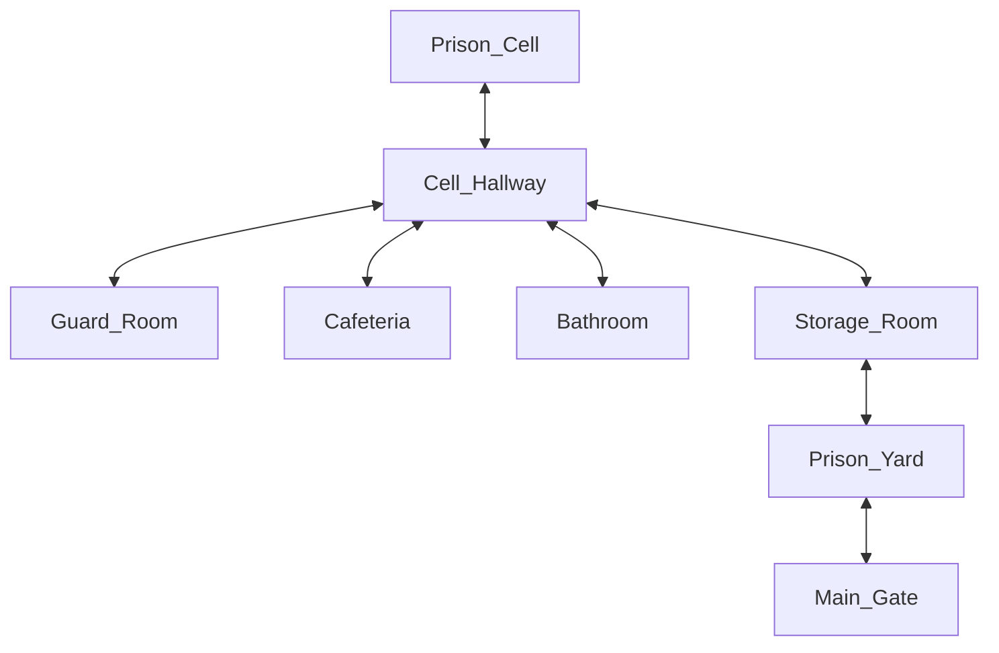

# Escape Jack's Prison

## Setting

This game takes place in a prison, I tried to make as realistic as I could to a real prison, making it very hard to escape.  
## Map

The prisoner will start in their prison cell, which is directed to the Cell Hallway after the Hallway their many rooms to enter, but they should make their way to the Main gate. 

## Story

Your a Prisoner and you wake up in your cell one night at 10:00pm all the guards are gone, but the prison is still locked down. You have to explore different parts of the prison to find a srewdriver, using the srewdriver to break the locker of the guard, to find the key and escape through the main gate and also eatfood so you don't get hungray.

The Prisoner also wakes up at 10:00pm and the guards clock back in at 7pm so the prisoner only has 9 hours to escape and every move costs 1 hour. So you only have 9 moves to complete this.
  
## Global Variables

I have 4 variables time, currentLocation, screwdriver, and guardKey.

currentLocaton: Will tell the current room the prisoner is in, so that the game can show the players their chocies.

time: Tracks the time during the escape. The game starts at 10pm and every move will cost 1 hour. If the time hits 7am the guards wake up and the player loses.

screwdriver: A tool found in the storage room that willa llow the player to unlock the locker in the guards room.

guardKey: The key needed to unlock the main gate and escape the prison. 
